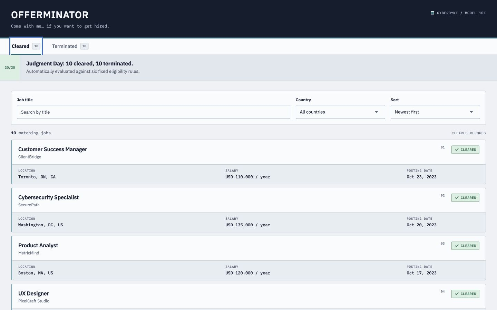
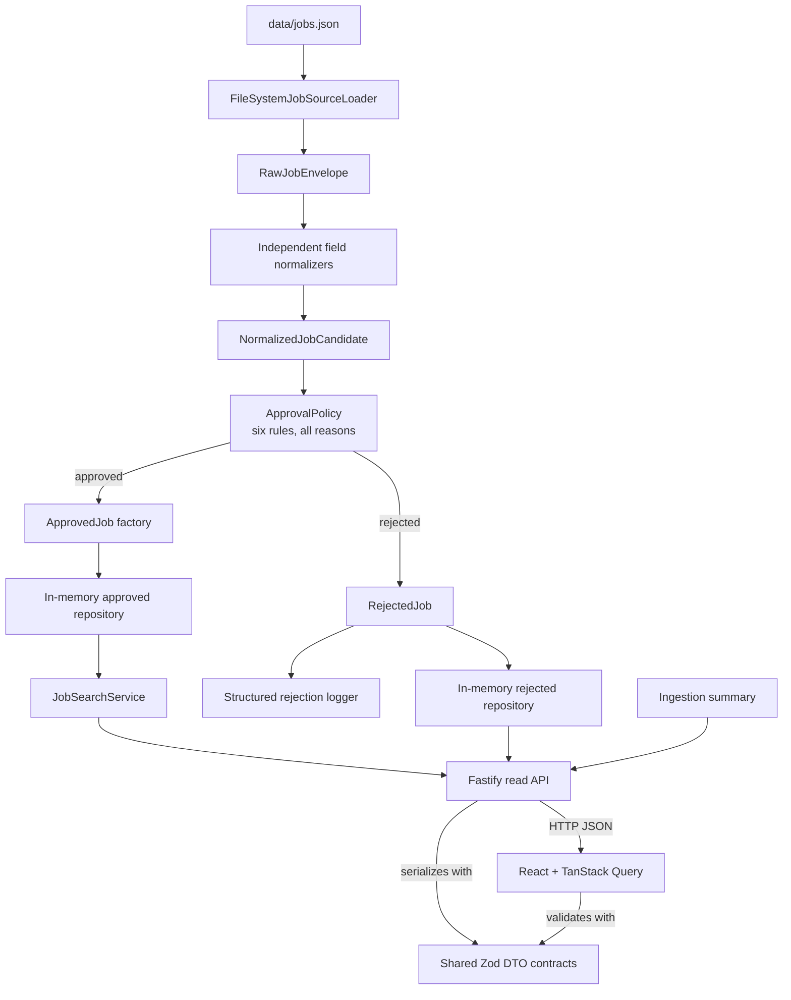

# Offerminator

Offerminator ingests a heterogeneous JSON job feed, normalizes each field independently, evaluates every record against six deterministic eligibility rules, and exposes the result through a Fastify API and a React interface.

Human decisions have been removed from job screening. Approval is automatic against explicit, deterministic rules; there is no manual-review workflow. The UI names the two outcomes **Cleared** and **Terminated**, but these are presentation labels for approved and rejected records, not mutable workflow states.



The restrained **Steel / Ember** presentation gives the two automatic outcomes distinct visual identities without turning them into a manual workflow: steel and cyan structure the Cleared view, retro green marks successful approval, and ember identifies Terminated records. The Terminator-inspired language is confined to presentation; controls remain literal and the domain continues to use approved/rejected terminology.

## Overview

The project is a strict TypeScript monorepo with three npm workspaces:

- `apps/api` — ingestion, normalization, approval, in-memory storage, search, structured rejection logging, and the Fastify HTTP boundary;
- `packages/api-contracts` — shared Zod response schemas and transport types used by both applications;
- `apps/web` — a React and Vite interface backed by TanStack Query.

The application intentionally minimizes infrastructure. It invests instead in explicit domain models, fail-closed handling of uncertain input, deterministic money and date comparisons, stable reason codes, and focused tests. The assignment supplies one heterogeneous JSON array containing flat, structured, and hybrid record representations; the unchanged bundled `data/jobs.json` preserves that feed and is ingested once during bootstrap, before Fastify starts listening.

## Quick start

Node.js 24 LTS is recommended. The repository records Node.js `24.19.0` in
`.nvmrc` and npm `11.17.0` in `packageManager` as the known-good CI toolchain,
not as exact local installation requirements. A current npm bundled with a
supported Node.js release can run the project directly.

From the repository root:

```bash
npm install
npm run dev
```

The frontend is available at `http://localhost:5173`; the API listens on `http://localhost:3000`. The default API bind address and port are documented in `.env.example`:

```text
HOST=0.0.0.0
PORT=3000
```

The defaults require no environment configuration. If the API port is changed for local development, point the Vite proxy at the same port, for example:

```bash
PORT=3100 OFFERMINATOR_API_PROXY_TARGET=http://localhost:3100 npm run dev
```

Press `Ctrl+C` in the development terminal to stop both processes.

Run the quality gates separately with:

```bash
npm run lint
npm run typecheck
npm test
npm run build
```

## Demo flow

1. Start the API and frontend with `npm run dev`.
2. Confirm the ingestion summary: `10 approved`, `10 rejected`.
3. Confirm the Cleared success state and the intentional `Date unavailable` value on Growth Marketing Manager.
4. Search for `engineer`.
5. Filter by Canada, then Germany, and use **Clear filters** from the empty state.
6. Sort by **Highest salary**.
7. Sort by **Newest first**.
8. Confirm Growth Marketing Manager is last because its posting date is `null`.
9. Focus the result tabs and open **Terminated** with Arrow Right or End.
10. Find OpsFlex, inspect all four rejection reasons, and open its bounded raw preview.
11. Confirm the Terminated view exposes no mutation action.

## Architecture



`bootstrap.ts` is the composition root. It creates the fixed-rate currency converter, compensation policy, approval policy, repositories, ingestion service, search service, and logger adapter. The core depends on small ports rather than Fastify or Pino; HTTP routes and logging are adapters around the application and domain logic.

The API and frontend share response schemas, but not domain objects. Fastify serializes against the Zod contracts, while the frontend receives network payloads as `unknown` and parses them with the same schemas before treating them as DTOs (Data Transfer Objects).

`@fastify/swagger` and `openapi-types` are installed because they are mandatory peer dependencies of `@fastify/type-provider-zod@1.0.0`. Offerminator does not register the Swagger plugin and does not expose an OpenAPI document.

## Data pipeline

1. `FileSystemJobSourceLoader` reads explicitly identified configured files concurrently and classifies source failures as `FILE_NOT_FOUND`, `INVALID_JSON`, `ROOT_NOT_ARRAY`, or `READ_ERROR`.
2. Each array element receives a stable envelope containing the configured `sourceId`, the file-name label `source`, zero-based `sourceIndex`, an ID built from `sourceId` and the index, and the untouched payload. Distinct configured IDs keep equal file basenames distinguishable without exposing filesystem paths.
3. `normalizeJob` validates only the top-level record shape, then normalizes strings, location, salary, enums, and posting date independently. The single supplied array deliberately mixes flat, structured, and hybrid representations, so every record can contribute each valid field it contains.
4. `ApprovalPolicy` creates a fresh `ApprovalContext` for the record and runs all six rules. It aggregates every rejection reason instead of stopping at the first failure.
5. An approved candidate passes through the `ApprovedJob` factory and is stored in the approved repository. A rejected candidate retains its raw payload, stable reason codes, and normalization warnings in the rejected repository and emits one structured log event.
6. The service produces a per-source and aggregate summary. Bootstrap awaits the entire ingestion before calling `listen`.

An unexpected exception while normalizing or evaluating one record becomes a generic `PROCESSING_ERROR` rejection and the batch continues. A repository or logger failure is different: it aborts ingestion because a complete and trustworthy summary can no longer be guaranteed.

An `IngestionService` instance is deliberately one-shot. Its guard is set before the first asynchronous operation, so sequential and concurrent second calls fail without loading or duplicating records. A new run requires a fresh application/service instance.

## Domain model

The model makes uncertainty explicit instead of representing partially validated jobs as if they were approved:

- `RawJobEnvelope` identifies an opaque source payload.
- `NormalizedJobCandidate` contains independently normalized fields and retains warnings and raw input.
- `Salary` is a discriminated union of `annual`, `hourly`, and `unknown`; an unknown salary carries a precise normalization reason.
- `JobLocation` is a discriminated union of `remote`, `in-person`, and `unknown`.
- `ApprovedJob` is constructed through a branded factory that narrows the structural invariants required by downstream search and DTO mapping.
- `RejectedJob` carries all rejection reasons, warnings, and raw diagnostic input.
- `ApprovalDecision` is an explicit approved/rejected union.

Raw location objects may contain a field named `state`. Normalization deliberately maps that transport-specific key to the domain field `location.region`. The domain therefore does not imply that every subdivision is a US state, while the original location value remains available in `raw`.

`ApprovedJob` stores converted and annualized USD cents once. Search reads the precomputed annualized value; it does not repeat currency conversion or the `2,080`-hour calculation.

## Approval criteria

All six rules run for every normalized candidate:

| Criterion    | Approval rule                                                                                                                   | Representative rejection codes                                                                                                      |
| ------------ | ------------------------------------------------------------------------------------------------------------------------------- | ----------------------------------------------------------------------------------------------------------------------------------- |
| Title        | A non-empty title is required.                                                                                                  | `TITLE_MISSING`                                                                                                                     |
| Location     | Remote jobs are allowed. In-person jobs require an assigned country code of `US` or `CA`.                                       | `LOCATION_UNKNOWN`, `IN_PERSON_COUNTRY_UNKNOWN`, `IN_PERSON_COUNTRY_NOT_ALLOWED`                                                    |
| Employment   | Employment type must be full-time.                                                                                              | `EMPLOYMENT_TYPE_UNKNOWN`, `EMPLOYMENT_TYPE_NOT_FULL_TIME`                                                                          |
| Compensation | Annual salary must be strictly greater than USD 100,000; hourly salary must be strictly greater than USD 45 after conversion.   | `SALARY_MISSING`, `SALARY_INVALID`, `SALARY_CURRENCY_UNSUPPORTED`, `ANNUAL_SALARY_BELOW_THRESHOLD`, `HOURLY_SALARY_BELOW_THRESHOLD` |
| Company type | Direct employers and consulting agencies are accepted; staffing firms are rejected.                                             | `COMPANY_TYPE_UNKNOWN`, `STAFFING_FIRM`                                                                                             |
| Language     | English is accepted everywhere. French is accepted only when the normalized country is Canada, including a remote Canadian job. | `LANGUAGE_MISSING`, `LANGUAGE_NOT_ALLOWED`                                                                                          |

Thresholds use a strict `>` comparison: exactly USD 100,000 annually or USD 45 hourly fails, while USD 100,000.01 or USD 45.01 passes. Unknown or malformed values fail closed with explicit reasons.

The rules return a uniform list of reasons. Salary calculation additionally records validated compensation through the per-evaluation `ApprovalContext`, avoiding a second conversion. If all rules pass, the `ApprovedJob` factory applies a second structural/type gate; a disagreement in which rules pass but the factory cannot construct an approved job is raised as an invariant violation rather than silently approved.

## Assumptions

- A flat numeric salary is interpreted as an annual USD salary.
- A structured salary requires a positive finite numeric `value` and a currency. Exactly three ASCII letters are canonicalized to uppercase during ingestion; non-ASCII identifiers cannot fold into a supported currency and remain unsupported.
- A structured salary defaults to `annual` only when `unit` is absent or `undefined`. An explicit invalid value, including `null`, is not defaulted and becomes `Salary.unknown`.
- Hourly salary is annualized with `40 hours/week * 52 weeks = 2,080 hours/year`.
- Missing, `undefined`, or blank optional `posting_date` produces `null` without a warning. A non-empty invalid value produces an `INVALID_POSTING_DATE` warning but does not itself reject the job.
- Posting dates are calendar strings in strict `YYYY-MM-DD` form. They are not converted through `Date`, so timezone cannot change the represented day.
- Input strings are trimmed; absent, non-string, and blank optional strings normalize to `null`.
- Configured source IDs are non-empty, trimmed, and unique within an ingestion. Source indices are zero-based; together they form record IDs such as `jobs.json:19`.
- The brief's closing reference to "both feeds" is interpreted against the supplied artifact: one JSON array that mixes structured, flat, and hybrid record representations. Bootstrap preserves that unchanged array as one source; the loader itself accepts multiple configured files.
- TypeScript and Fastify were selected to keep the implementation in a strongly owned stack while providing runtime validation at the I/O boundaries.

## Fixed currency rates

Rates are deterministic dependencies, expressed as USD cents per one source-currency unit:

| Currency | USD value | Cents used by converter |
| -------- | --------: | ----------------------: |
| USD      |      1.00 |                     100 |
| CAD      |      0.74 |                      74 |
| GBP      |      1.25 |                     125 |
| EUR      |      1.08 |                     108 |

The converter computes `Math.round(amount * centsPerUnit)` exactly once. For example, GBP 85,000 becomes USD 106,250. Unsupported currencies return an explicit conversion failure; there is no live exchange-rate fallback.

## Expected results

The canonical fixture produces:

```json
{
  "totalSources": 1,
  "successfulSources": 1,
  "failedSources": 0,
  "totalRecords": 20,
  "approved": 10,
  "rejected": 10
}
```

Approved titles, in source order:

1. Backend Engineer
2. Machine Learning Engineer
3. Agile Project Lead
4. Senior Software Engineer
5. QA Automation Engineer
6. UX Designer
7. Product Analyst
8. Cybersecurity Specialist
9. Growth Marketing Manager
10. Customer Success Manager

Expected rejected records and complete reason-code sets:

| Source index | Record                        | Reason codes                                                                                       |
| -----------: | ----------------------------- | -------------------------------------------------------------------------------------------------- |
|            1 | Frontend Developer Intern     | `EMPLOYMENT_TYPE_NOT_FULL_TIME`, `ANNUAL_SALARY_BELOW_THRESHOLD`, `STAFFING_FIRM`                  |
|            4 | DevOps Consultant             | `EMPLOYMENT_TYPE_NOT_FULL_TIME`                                                                    |
|            6 | Junior Developer              | `ANNUAL_SALARY_BELOW_THRESHOLD`, `STAFFING_FIRM`, `LANGUAGE_MISSING`                               |
|            7 | Data Scientist                | `ANNUAL_SALARY_BELOW_THRESHOLD`                                                                    |
|            8 | Project Manager               | `ANNUAL_SALARY_BELOW_THRESHOLD`                                                                    |
|           12 | Mobile Engineer               | `IN_PERSON_COUNTRY_NOT_ALLOWED`, `ANNUAL_SALARY_BELOW_THRESHOLD`, `LANGUAGE_NOT_ALLOWED`           |
|           13 | Technical Writer              | `EMPLOYMENT_TYPE_NOT_FULL_TIME`, `ANNUAL_SALARY_BELOW_THRESHOLD`                                   |
|           16 | Database Administrator        | `EMPLOYMENT_TYPE_NOT_FULL_TIME`, `STAFFING_FIRM`                                                   |
|           17 | Business Operations Associate | `ANNUAL_SALARY_BELOW_THRESHOLD`                                                                    |
|           19 | OpsFlex (empty title)         | `TITLE_MISSING`, `EMPLOYMENT_TYPE_NOT_FULL_TIME`, `HOURLY_SALARY_BELOW_THRESHOLD`, `STAFFING_FIRM` |

The integration test asserts the titles and reason-code sets, not only the aggregate `10 / 10` count.

## Search semantics

Search operates only on approved jobs and applies this pipeline:

1. title filter;
2. country filter;
3. requested sort;
4. deterministic tie-breakers by title, then ID.

`q` is trimmed and matched case-insensitively as a substring of the title only. It does not search company or description. A missing or blank query applies no title filter.

`country` is trimmed, uppercased, and validated with the same `createCountryCode` factory used by the domain. Validation checks that the code is assigned in ISO 3166-1, not merely that it contains two letters. Consequently:

- `country=DE` is valid and returns `200` with an empty approved list for the canonical fixture;
- `country=ZZ` is unassigned and returns `400`;
- malformed values such as `invalid` and `123` also return `400`.

Germany is intentionally present in the UI filter even though no approved job is German. It makes the real empty state available in one click and demonstrates that the rejected German Mobile Engineer does not leak into approved search results.

Supported sorts are:

| Query value         | Meaning                             |
| ------------------- | ----------------------------------- |
| `posting-date-desc` | Newest date first; default          |
| `posting-date-asc`  | Oldest date first                   |
| `salary-desc`       | Highest annualized USD salary first |
| `salary-asc`        | Lowest annualized USD salary first  |

Salary sort compares the precomputed `annualizedSalaryUsdCents`, so annual and hourly jobs are comparable. A `null` posting date is always last in both date directions. Ties use `<` and `>` on title and then ID, which compares UTF-16 code units and is deterministic across process locales and ICU versions. It is a technical stability order, not user-facing locale-aware alphabetization.

## API

All endpoints are read-only:

| Method | Path                     | Purpose                                                                     |
| ------ | ------------------------ | --------------------------------------------------------------------------- |
| `GET`  | `/api/health`            | Liveness response: `{ "status": "ok" }`                                     |
| `GET`  | `/api/ingestion-summary` | Aggregate and per-source result of the completed bootstrap ingestion        |
| `GET`  | `/api/jobs`              | Approved jobs with optional `q`, `country`, and `sort` query parameters     |
| `GET`  | `/api/rejected-jobs`     | All rejected jobs with source reference, reasons, and a bounded raw preview |

Example:

```bash
curl 'http://localhost:3000/api/jobs?q=engineer&country=US&sort=salary-desc'
```

Invalid query parameters return `400` with a generic transport error. Unexpected route failures return `500` without exposing the internal cause. Domain objects are mapped to dedicated DTOs: internal `actualValue` fields and normalization warnings are not exposed by the rejected-jobs endpoint, and an unsupported currency is not interpolated into its public reason message.

Both non-paginated collection schemas require `total` to equal `items.length`. The rejected endpoint keeps the complete raw value inside the domain and storage boundary, while the transport exposes only a size-bounded diagnostic preview with an explicit truncation flag when a depth, width, entry, key, or string limit is reached.

There are no mutation, approval, restore, edit, or delete endpoints.

## Tests

The test suite uses synthetic fixtures for edge cases and preserves the canonical `data/jobs.json` unchanged.

- Model and normalizer tests cover branded values, flat/object/hybrid shapes, location aliases, `state -> region`, salary defaults, enums, and strict calendar dates.
- Approval tests cover every rule, strict threshold boundaries, all-reason aggregation, the approved factory gate, and language eligibility.
- Currency and annualization tests derive safe numeric boundaries for every fixed rate and verify explicit out-of-range failures.
- The full ingestion integration test reads all 20 canonical records and asserts the exact approved titles, rejected indices, reason-code sets, logs, summary, safe salary maxima, and one-shot guard.
- Repository and search tests cover snapshot isolation, combined filters, all four sort modes, annual/hourly comparability, `null` dates, and deterministic ties.
- Fastify tests use `inject()` to exercise successful DTOs, validation errors, generic failures, and every endpoint without opening a network port.
- Frontend tests use Testing Library and jsdom for API response validation, filters, retries, states, accessible tabs, the read-only rejected view, raw disclosure, proxy behavior, and structural CSS contracts.
- `apps/api/test/models/domainModel.typecheck.ts` keeps compile-time model contracts under `tsc`, including closed failure unions and rejected invalid construction examples.

Run all automated checks from the repository root:

```bash
npm run lint
npm run typecheck
npm test
npm run build
```

## Trade-offs

### Money representation

Converted amounts are integer USD cents. The converter rounds once with `Math.round`, making threshold and sort comparisons stable and avoiding repeated floating-point arithmetic. Successful conversion and annualization results must satisfy `Number.isSafeInteger`; checking only finiteness would still admit finite values above `Number.MAX_SAFE_INTEGER`, where comparisons lose precision.

Conversion and annualization guard their own outputs independently. An out-of-range result maps to the existing domain code `SALARY_INVALID`; unsupported currency remains distinct as `SALARY_CURRENCY_UNSUPPORTED`. This is a representation-safety rule, not a speculative salary-plausibility heuristic.

### Rules and approved construction

Returning all reasons gives complete diagnostics but performs more work than fail-fast evaluation. `ApprovalContext` is a controlled per-record output channel for calculated compensation, preserving a uniform rule signature without converting twice. The approved factory independently narrows structural invariants; it intentionally does not repeat conversion, annualization, or threshold evaluation.

### Storage and ingestion

In-memory repositories are sufficient for one deterministic startup ingestion and keep ports easy to replace in tests. The cost is no persistence, deduplication, cross-process coordination, or in-process re-ingestion. The explicit one-shot guard is preferable to letting summary and repository contents diverge after a second run.

### Operational rejection logging

Ordinary rejection events contain the event name, job ID, configured source ID, file-name source label, source index, and reason codes. Only technical per-record `PROCESSING_ERROR` events add a controlled `processingError` descriptor:

- an `Error` contributes exactly `name` and `message`;
- `message` is limited to 1,024 UTF-16 code units; longer messages retain a prefix and end with `… [truncated]` within that limit;
- a non-`Error` value contributes only `{ "type": typeof value }`, without stringifying its content;
- stack, cause, enumerable custom properties, the original error instance, and the raw thrown value are not passed to Pino.

The limit bounds the message's contribution to log size. It does **not** sanitize the retained prefix, limit `Error.name`, or make the whole event safe for an untrusted sink. The original cause never enters `RejectedJob`, a DTO, or an HTTP response; those retain the generic `PROCESSING_ERROR` message.

### Transport and dependencies

Shared Zod response contracts prevent the backend and frontend from silently drifting, at the cost of a small shared transport package. Fixed FX rates and in-memory ports make tests deterministic but are deliberately not production market data or persistence.

## Requirements traceability

[`docs/traceability.md`](docs/traceability.md) maps each requirement, in summarized form, to its implementation, behavioral evidence, and the relevant README section. It is the concise audit trail for the solution rather than a copy of the original brief.

## Production evolution

The existing boundaries allow focused upgrades without rewriting the approval rules:

- replace in-memory repositories with transactional persistence behind the existing repository ports;
- map configured source identities to upstream-stable record keys and idempotent upserts before scheduling repeat ingestion;
- move ingestion to a job runner or queue, with explicit retry and partial-failure policy;
- replace fixed FX with a versioned rate provider whose snapshot and effective time are stored with each decision;
- add pagination and database/index-backed search when the dataset justifies it;
- publish static frontend assets and route `/api` through the same-origin reverse proxy used in development;
- register OpenAPI deliberately if it becomes a delivery requirement, then document and test the published contract;
- add metrics, tracing, and sink-level log redaction appropriate to the deployment's trust boundary;
- add authentication and authorization before introducing any administrative or mutation capability;
- extend the ordered `ApprovalRule` collection or inject a different `CompensationPolicy` for new explicit business rules, without adding a generic rules DSL prematurely.

## Known limitations

- Location-string parsing is intentionally simple and deterministic. It recognizes selected country aliases and comma-separated segments, but it is not a postal-address parser and cannot infer every international location accurately.
- Data is stored in memory and disappears on process exit. The application ingests exactly once per service instance and has no hot reload or retry after a partial startup failure.
- Source identity is explicit application configuration, not an upstream record key. Changing a configured `sourceId` changes the generated record IDs, and there is no deduplication because the input contract does not provide stable external record IDs.
- FX rates are fixed test values, not live or historically versioned market rates.
- Search has no pagination or external index; it filters and sorts the complete approved in-memory collection.
- The processing-error truncation uses JavaScript string slicing over UTF-16 code units. At the exact boundary, a non-BMP character's surrogate pair can be split; the result remains JSON-serializable but a downstream log pipeline may render it differently.
- There is no authentication, role-based access control, manual-review workflow, or record-level mutation API.

## AI assistance

AI tools were used as an engineering aid for exploration, implementation support, and review. All architectural decisions, implementation details, tests, assumptions, and trade-offs were reviewed and are fully owned by the author.

## UI, accessibility and visual verification

The interface follows a mobile-first **Steel / Ember** direction: steel-toned surfaces, cyan for Cleared, ember for Terminated, sharp geometry, locally bundled IBM Plex Sans and IBM Plex Mono, and visible focus treatment. Named `min-width` custom media centralize breakpoints; feature styles do not repeat numeric breakpoint values or use desktop-first `max-width` queries.

The browser client calls only relative `/api` paths. Vite proxies them to Fastify during development, avoiding a hardcoded backend URL in application code and avoiding local CORS configuration. Ingestion summary and list queries are independent, so a summary failure has its own retry and does not hide the job lists. The Terminated collection is not requested until that tab is opened for the first time.

Cleared implements success, loading, error, and empty states, plus an explicit updating state while debounced filters fetch a new result. Terminated is entirely read-only: it exposes every reason and a native `details`/`summary` disclosure for the bounded raw preview, with internal horizontal scrolling and no record-level action.

Visible labels, semantic landmarks, text and glyph status cues, `aria-live`/`aria-busy` states, and `:focus-visible` styling avoid color-only or pointer-only interaction. Card labelling uses local React IDs rather than domain record IDs, so configured source identifiers cannot invalidate ARIA ID references. Cleared and Terminated use automatic-activation tabs with roving `tabIndex`; Left, Right, Home, and End move and activate tabs, while native buttons retain Enter and Space behavior. The raw-record disclosure retains native keyboard semantics.

Scalable typography, spacing, component dimensions, and mobile-first breakpoints use `rem`, so enlarged browser defaults can influence both content and layout. Deliberate CSS-pixel exceptions are limited to technical hairlines, border/focus thickness, border overlap, and the visually-hidden recipe.

Visual verification covers a 360 px mobile viewport and a 1,440 px desktop viewport, the intermediate named breakpoints, absence of page-level horizontal overflow, keyboard focus order, the read-only boundary, and internal scrolling of long raw previews. The 360 px check is repeated with the browser's default font enlarged to 32 px: header text and tabs reflow, while only the preview's code block scrolls horizontally.
